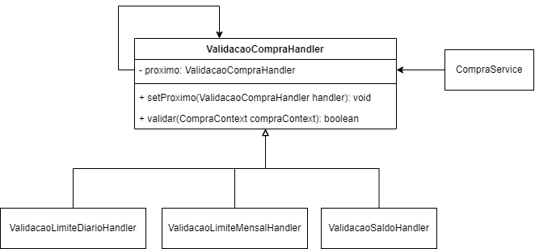

# Chain of Responsability

Universidade do Vale dos Sinos.

Alunos: Bruno Hoffmann e Marcos Berté.

Professora: Cassia Nino.

## Estrutura de Pastas
- src/java: conterá a implementação do padrão de projeto.
- src/test: conterá a implementação de testes de unidade que verificam o código desenvolvido.
- docs: conterá documentações.

## Diagramas
- Diagrama de classe:

## Documentos
- Apresentação: https://docs.google.com/presentation/d/14InKcxYYCXBGfv82lqB1jRXoGI7CwYqH8VjeyCXYXU8/edit?usp=sharing